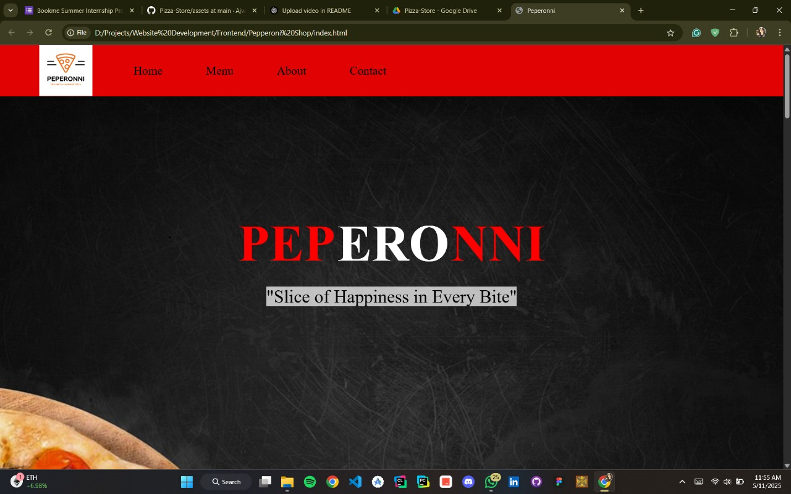

# 🍕 Pizza Palace - Frontend Website

Welcome to **Pizza Palace** – a visually engaging and responsive pizza store frontend built using **HTML** and **CSS**. The website features smooth animations, a stylish navigation bar, attractive deals, and a deliciously laid-out menu section.

---

## 🎯 Features

- 🧭 **Responsive Navigation Bar** – Easy navigation across sections  
- 🍕 **Interactive Pizza Menu** – Showcases pizza items with hover animations  
- 💸 **Deals Section** – Highlights limited-time offers  
- ✨ **CSS Animations & Transitions** – Enhances user experience with smooth effects  
- 📱 **Responsive Design** – Adapts to different screen sizes

---

## 🎬 Demo Video

[](https://drive.google.com/file/d/1XUdLodE_AK35_p1EMP5V229j7Rc7BFZU/view?usp=sharing)

> 🎥 Click the image above to watch the live demo hosted on Google Drive.

---

## 🚀 How to Use

1. Clone the repository:
   ```bash
   git clone https://github.com/your-username/pizza-palace-frontend.git
